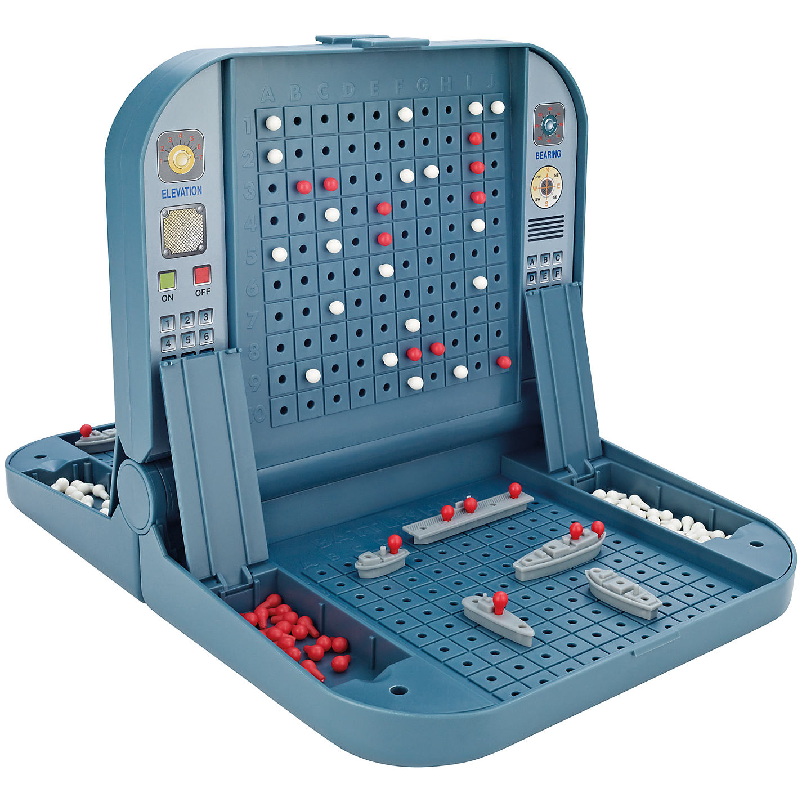

# Homework Assignment #6

### Date: 06-08-2024

### Due date: 27-08-2024

## Three-dimensional _Submarines_ Game

This homework has but one assignment - design a "Submarines" game, AKA "Battleship". As you might recall,
in Submarines each player has a board, hidden from his or her opponent, with "submarine-like" pieces
placed on it. At each turn a player targets a specific cell in the other player's board, in
hopes of hitting a marine vessel. The targeted player announces if one of his vessels was
hit, and when all vessels as sunk the game is over.

<div style="text-align:center">

<div style="text-align:left">

The game we'll write will also serve two players, sitting on the same computer. Each player
fires at a specific coordinate, and if he hits the game should announce so. A screen cast
of the dynamics of the game can be found in this repo.

The game is a bit more unique that your standard Submarines game in a couple of ways:

1.  The game has three dimensions - three two-dimensional layers (deep sea, sea-level, and air). There are unique vessels
    for each layer:

        - Submarines (level 0): When hit, it instantly dies (`Signal.KILL` in the screen cast). Its shape:
        ```
                           1
        1  1  1     or     1
                           1
        ```
        - Destroyer (level 1): More sturdy, so it has to be gunned down completely for it to be taken down. Its shape:
        ```
                              1
        1  1  1  1     or     1
                              1
                              1
        ```
        - Jet (level 2): Like a submarine, a single hit destroys it. Shape:
        ```
        0 1 0        0  0  1  0
        1 1 1   or   1  1  1  1
        0 1 0        0  0  1  0
        0 1 0
        ```

2.  The game also has a unique _General_ piece, a single square in size, which can be
    located in any of the three layers. If this unit is hit, the game is instantly over. This
    is one of the "win conditons" of the game.
3.  The second "win condition" is when all the rest of the units besides the General are destroyed.

The goal here is to think about the design of the game with the principles we learned in class,
and then execute it. The interface to the user should be very simple - define the board size,
the number of pieces of each type, and write `start()`. The "back-end" should do all the heavy
lifting, including input verifications and so on.

Your design should be modular - any board size should be allowed (as long as it's 3D), any
number of units (but only one General), and the computer should randomly allocate the pieces on
each player's board.

### Grading

No tests are provided, since these will hint towards a "direction" as to how to design this game internally,
which is exactly what I want you to think about and practice. Hence I will examine closely the following aspects:

1. Simple, clean user API, with clear documentation of the relevant functions.
2. Extensibility: It shouldn't require much if I want to add another type of piece to the game.
3. Ability to `show` and `quit` during the game.
4. Testing.
5. Input verification.
6. Asserting that pieces do not overlap on the board, or go out-of-bounds.
7. Usage of objects (when needed), enumerations and other Pythonic advanced features where appropriate.

I've uploaded a demonstration of how the game should look like (the UI part only, obviously). You can check it out over [here](./screencast_submarines.mp4).

Good luck!
